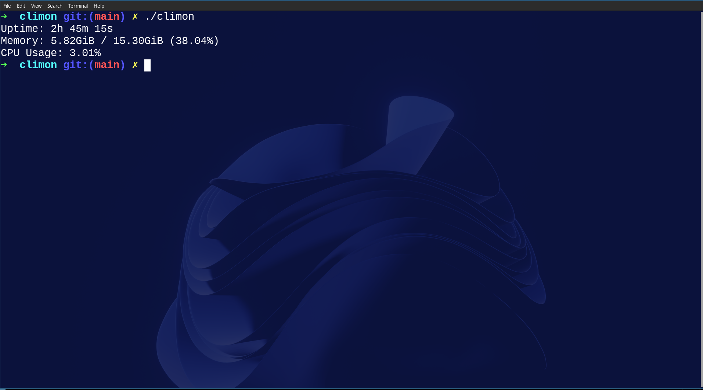

## Climon 
A minimalist,lightweight system monitor for Linux written in C.<br>

It is a low level utility that provides essential system metrics by parsing the linux kernel's pseudo filesystems  **/proc**.


### ✨ features
- Uptime view with hours, minutes and seconds.
- Total memory and used memory in GiB with percentage.
- Total CPU usage in percentage format. (calculated from /proc/stat)
### 🧠 What I learnt? 
I learnt how to handle files in C and how to navigate and understand processes in a Linux system, implemented functions and pointers and learned how to use the **<unistd.h>** library functions.
### ⌨️  Usage :
1. Clone the repository:
```
git clone git@github.com:oxtknight/climon.git
cd climon
```
2. Build the binary: 
```
make
``` 
3. Run:
 ```
./climon
```
### ✅ Future improvements
- Live updating.
- Better CLI format (colorized output)

